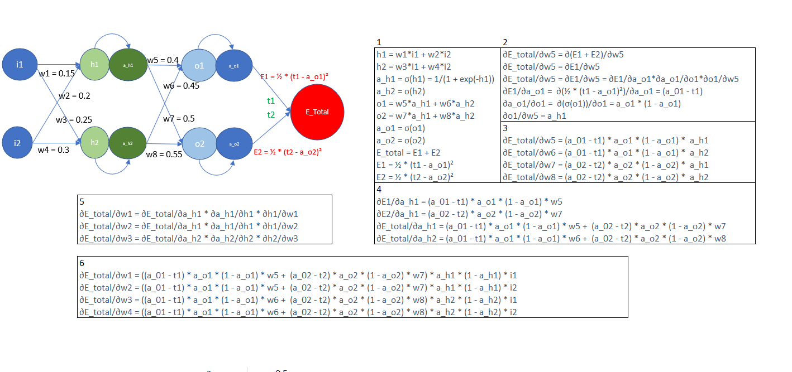
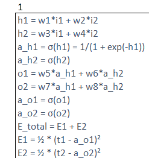

Above is the image of backpropagation calculation 

Above is the step 1 

Below is the line by line description of step 1

1) For calculating h1,weights 1 is being multiply with input 1 + weights 2 is being multiply with input 2
2) For calculating h2,weights 3 is being multiply with input 1 + weights 4 is being multiply with input 2
3) For calculating a_h1, we will apply sigmoid function to h1
4) For calculating a_h2, we will apply sigmoid function to h2
5) Same for calculating o1 we will multiply weights 5 with a_h1 + weights 6 with a_h2
6) Same for calculating o2 we will multiply weights 7 with a_h1 + weights 8 with a_h2
7) For calculating a_o1 we will apply sigmoid function to o1
8) For calculating a_o2 we will apply sigmoid function to o2
9) For calculating E_total we will sum E1 and E2
