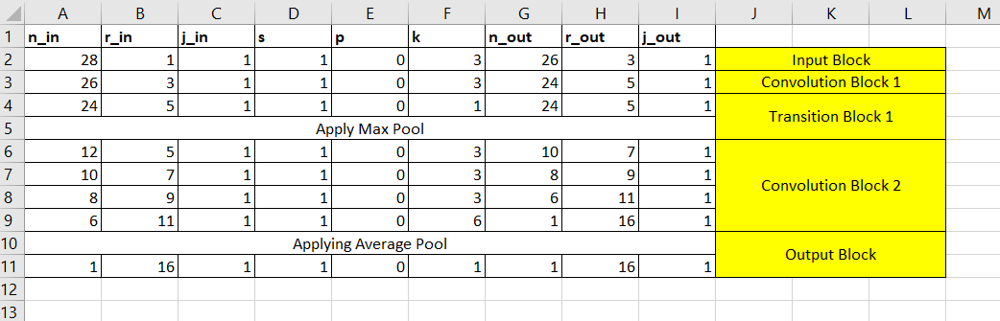

## Solutions 
The assignments solution are inside assignments folder

## Receptive Field Calculation for Model 1

## Receptive Field Calculation for Model 2

## Receptive Field Calculation for Model 3

## Receptive Field Calculation for Model 4

## Receptive Field Calculation for Model 5

## Receptive Field Calculation for Model 6

## Receptive Field Calculation for Model 7

## Receptive Field Calculation for Model 8

## Receptive Field Calculation for Model 9

## Receptive Field Calculation for Model 10

