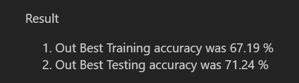

# CIFAR Dataset assignment was related to Making Network using Batch Normalization, Group Normalization & Layer Normalization

# 1. What is your code all about
### First we have downloaded the cifar dataset, then used Data Augumentation Technique, then our target was to make desired model like 
C1 - Conv1

C2 - Conv2

c3 - Conv layer with 1x1 kernel

P1 - Max Pool layer

C3 - Conv3

C4 - Conv4

C5 - Conv5

c6 - Conv layer with 1x1 kernel

P2 - Max Pool layer

C7 - Conv7

C8 - Conv8

C9 - Conv8

GAP - Global Average Pool

C10 - Final Conv8 layer

and we have to make the above CNN with less than 50k parameters. I just missed out that parameters constraint of 50k. I have made my Batch & Group Normalization CNN with 52k parameters but my Layer Normalization CNNN parameters is 2.4 million

I have achieve the desired target accuracy of 70% in all the 3 models 

To increased the accuracy, i have also added one conv layer to another conv layer for some convolution layers in forward function.

I have got the below results in 20 epochs

### The result graph of group normalization is 

### The result graph of layer normalization is 

### Our Best The Training & Testing Accuracy for Batch Normalization is below

### Our Best The Training & Testing Accuracy for Group Normalization is below

### Our Best The Training & Testing Accuracy for Layer Normalization is below

