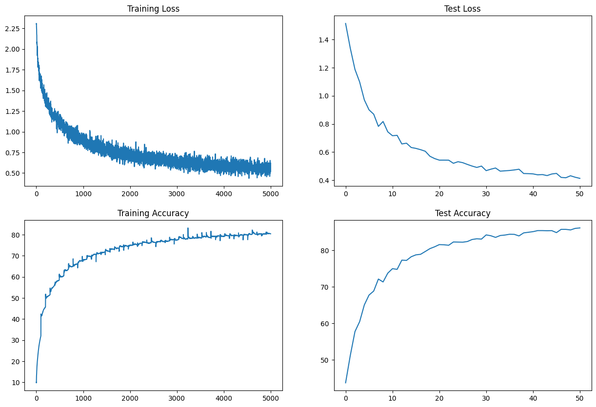

# ERA-Assigment 9

This assignment is related to ERA Session 9. Our task is to Move the contents of the code to the following files : Move the contents of the code to the following files:
1.model.py
2.utils.py
3.S9.ipynb

The Assignment task was :
1) Make this network:
  a) C1C2C3C40 (No MaxPooling, but 3 3x3 layers with stride of 2 instead)
2) Total Params to be less than 200k
3) Use argumentation library and apply:
  a) horizontal flip
  b) shiftScaleRotate
  c) coarseDropout (max_holes = 1, max_height=16px, max_width=1, min_holes = 1, min_height=16px, min_width=16px, fill_value=(mean of your dataset), mask_fill_value = None)
  Achieve 85% accuracy
4) Total RF must be more than 44
5) One of the layers must use Depthwise Separable Convolution
6) One of the layers must use Dilated Convolution

The Loss Output graph is below 

